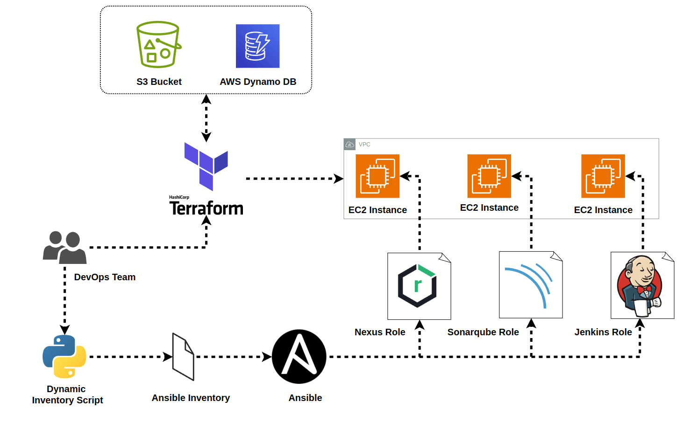

# Continous Integration Pipeline Configuration 
This repository contains code terraform modules and Ansible roles  for automating the management of EC2 instances using IAC and Configuration management using Ansible.
## Architecture Diagram

## Overview
This project automates the deployment of infrastructure on AWS using Terraform and configures it with Ansible. It orchestrates the creation of a Virtual Private Cloud (VPC), EC2 instances, and corresponding key pairs using Terraform. After provisioning, a dynamic inventory script written in Python (ec2.py) is utilized to dynamically populate Ansible's inventory with the provisioned EC2 instances. Subsequently, Ansible playbooks are executed to configure the EC2 instances according to defined roles and then output the secrets need for login.

## Project Structure
```
.
├── ansible
│   ├── ansible.cfg
│   ├── files
│   ├── inventory
│   │   └── hosts.ini
│   ├── playbooks
│   │   ├── playbook.yml
│   │   └── roles
│   │       ├── common
│   │       │   └── tasks
│   │       │       └── base.yaml
│   │       ├── jenkins_server
│   │       │   ├── defaults
│   │       │   │   └── main.yaml
│   │       │   ├── files  
│   │       │   ├── handlers
│   │       │   ├── meta
│   │       │   ├── tasks
│   │       │   │   └── main.yaml
│   │       │   ├── templates
│   │       │   └── vars
│   │       ├── nexus_server
│   │       │   ├── defaults
│   │       │   ├── files
│   │       │   ├── handlers
│   │       │   │   └── main.yaml
│   │       │   ├── meta
│   │       │   ├── tasks
│   │       │   │   └── main.yaml
│   │       │   ├── templates
│   │       │   │   ├── nexus.service.j2
│   │       │   │   └── nexus.vmoptions.j2
│   │       │   └── vars
│   │       │       └── main.yaml
│   │       └── sonarqube_server
│   │           ├── defaults
│   │           ├── files
│   │           ├── handlers
│   │           │   └── main.yaml
│   │           ├── meta
│   │           ├── tasks
│   │           │   └── main.yaml
│   │           ├── templates
│   │           │   ├── sonarqube_nginx.conf.j2
│   │           │   └── sonar.service.j2
│   │           └── vars
│   │               └── main.yaml
│   ├── secrets
│   │   ├── jenkins_password.txt
│   │   └── nexus_password.txt
│   └── templates
├── backend.tf
├── ec2.py
├── environments
│   └── backend
│       ├── main.tf
│       ├── outputs.tf
│       ├── terraform.tfstate
│       └── variables.tf
├── jenkins.pem
├── LICENSE
├── main.tf
├── modules
│   ├── ec2
│   │   ├── main.tf
│   │   ├── outputs.tf
│   │   └── variables.tf
│   ├── iamrole
│   │   ├── main.tf
│   │   ├── outputs.tf
│   │   └── variables.tf
│   └── vpc
│       ├── main.tf
│       ├── outputs.tf
│       └── variables.tf
├── nexus.pem
├── outputs.tf
├── provider.tf
├── README.md
├── sonarqube.pem
├── terraform.tfvars
└── variables.tf
```
## Setup Instructions

 1. **Prerequisites:**
   * Ensure you have AWS credentials configured with appropriate permissions.
   * Install Terraform and Ansible on your local machine.

 2. **Terraform Setup:**
   - First execute the backend environment to make sure the s3 and dynamo db table have been set for remote state store and state locking. 
   - Modify `variables.tf` in the environment/backend folder to set the names of the s3 bucket and dynamo db table name.
   - Return to the parent directory and modify  `terraform.tfvars` to customize your infrastructure settings.
   - Run `terraform init` to initialize the Terraform environment.
   - Run `terraform plan` to review the planned infrastructure changes.
   - Run `terraform apply` to apply the Terraform configurations and provision the infrastructure.

 3. **Dynamic Inventory Setup:**
   - Ensure the `ec2.py` script is executable (`chmod +x ec2.py`).
```
    python3 ec2.py
```
   - Run the script after you have provisioned the terraform infrastructure.
   - This script will load the connection details in the 'hosts.ini' file for Ansible to connect the instance and also populate the sonarqube URL in the sonar scanner properties.

4. **Ansible Playbook Execution:**
   - Navigate to the `ansible` directory.
   - Run `ansible-playbook playbook.yml` to execute the Ansible playbook and configure the provisioned EC2 instances.
``` 
sudo ansible-playbook -i inventory/hosts.ini playbooks/playbook.yml 
```
5. You will find the necessary admin passwords for Jenkins and Nexus in the secrets folder in the parent directory
## Usage

Once the setup is complete, you can use this project to automate the deployment and configuration of infrastructure on AWS. You can customize the Terraform configurations and Ansible playbooks to meet your specific requirements.


## Connect with Us
- Website: [https://pinakaops.in]
- Twitter: [https://twitter.com/Ashnilnike]
- LinkedIn: [https://www.linkedin.com/in/ashnil-naik-b65b49210/]
